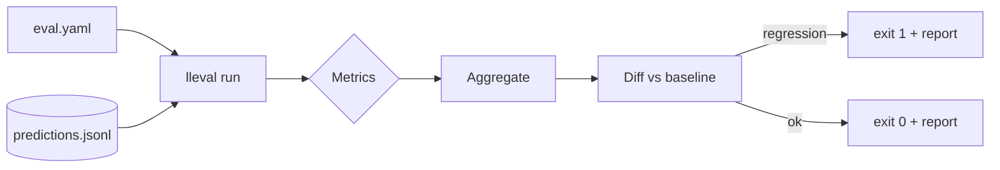

# LLM Eval Harness

> Drop-in evaluation for any GenAI repo: **plugin metrics**, **LLM-as-Judge**
> (with stored reasoning traces), **HTML/JSON/Markdown diff reports**, a **trend
> dashboard**, and a **reusable GitHub Action** that fails a PR when answer
> quality regresses. Runs **offline and deterministically** by default.

<!-- Badges placeholder: CI · license · coverage -->

---

## Contents

- [Why this exists](#why-this-exists)
- [How it works](#how-it-works)
- [Prerequisites](#prerequisites)
- [Installation](#installation)
- [Usage](#usage)
- [Configuration (`eval.yaml`)](#configuration-evalyaml)
- [Metrics](#metrics)
- [Use it in CI (3 lines)](#use-it-in-ci-3-lines)
- [Trend dashboard](#trend-dashboard)
- [Dataset versioning (DVC)](#dataset-versioning-dvc)
- [Adding a metric](#adding-a-metric)
- [Project layout](#project-layout)
- [Testing](#testing)
- [Limitations](#limitations)

## Why this exists

Unit tests catch crashes, not "the answers got worse." This harness scores your
model's **recorded outputs**, diffs them against a baseline, and **gates merges
on quality regression** — the part teams keep rebuilding by hand.

## How it works

Separation of concerns: *you* produce model outputs your way and record them to
JSONL; the harness *scores* them. One prediction record per line:

```json
{"id": "q1", "input": "What is pgvector?", "output": "A Postgres extension for vector search.",
 "contexts": ["pgvector adds vector similarity search to Postgres."],
 "reference": "A Postgres extension for vector similarity search."}
```



Full design: [docs/architecture.md](docs/architecture.md).

## Prerequisites

- **Python 3.12+**. Nothing else for the offline core (the default judge is
  deterministic). Optional: Node 20+ for the dashboard; `dvc` for dataset
  versioning; framework extras for Ragas/DeepEval.

## Installation

```bash
git clone https://github.com/jeanmalaquias/llm-eval-harness.git
cd llm-eval-harness
python -m venv .venv && source .venv/bin/activate   # Windows: .venv\Scripts\activate
pip install -e ".[dev]"
```

Optional framework extras: `pip install -e ".[ragas]"` or `".[deepeval]"`.

## Usage

Try it against the bundled example app:

```bash
lleval run --config examples/rag-app/eval.yaml
```

Expected output:

```
| metric | score |
| --- | --- |
| exact_match | 0.000 |
| keyword_coverage | 1.000 |
| groundedness | 0.532 |
| llm_judge | 0.900 |

No regressions. Gate passed.
```

Common commands:

```bash
lleval run --config eval.yaml                      # gate (exit 1 on regression)
lleval run --config eval.yaml --update-baseline    # accept current scores as baseline
lleval run --config eval.yaml --html report.html   # also write an HTML diff report
lleval run --config eval.yaml --history runs.jsonl # append a {timestamp, aggregate} point
```

## Configuration (`eval.yaml`)

```yaml
dataset: predictions.jsonl          # JSONL of prediction records (required)
baseline: baseline.json             # aggregate scores to diff against (required)
metrics: [exact_match, keyword_coverage, groundedness, llm_judge]
threshold: 0.05                     # max allowed drop per metric before failing
judge: heuristic                    # llm_judge backend (heuristic = offline default)
promptfoo_results: null             # optional path to a Promptfoo results JSON
```

| Key | Default | Notes |
|-----|---------|-------|
| `dataset` | — | path to the predictions JSONL |
| `baseline` | — | path to the baseline aggregate JSON |
| `metrics` | — | any of the built-ins or `ragas` / `deepeval` / `promptfoo` |
| `threshold` | `0.05` | a metric dropping more than this fails the gate |
| `judge` | `heuristic` | swap to a real provider judge |
| `promptfoo_results` | `null` | consumed by the `promptfoo` metric |

## Metrics

Built-in, offline, deterministic:

| Metric | Measures | Needs |
|--------|----------|-------|
| `exact_match` | output == reference (normalized) | `reference` |
| `keyword_coverage` | fraction of reference keywords in output | `reference` |
| `groundedness` | fraction of output supported by contexts | `contexts` |
| `llm_judge` | a judge's rating (trace stored for audit) | `reference` |

Framework adapters (optional extras): **Ragas** and **DeepEval** plug in as
per-record metrics; **Promptfoo** (a Node CLI suite-runner) is *ingested* from
its results JSON. Select any by name in `metrics`.

## Use it in CI (3 lines)

```yaml
- uses: jeanmalaquias/llm-eval-harness@v1
  with:
    config: eval.yaml
```

## Trend dashboard

`dashboard/` is a Next.js 15 app charting metric trends from
`lleval run --history` output:

```bash
cd dashboard && npm install && npm run dev   # http://localhost:3000
```

## Dataset versioning (DVC)

Version large golden sets with DVC (Git tracks a pointer; bytes live in a
remote) — see [docs/dataset-versioning.md](docs/dataset-versioning.md).

## Adding a metric

Create one file in `src/lleval/metrics/`, implement the `Metric` protocol
(`name`, `requires`, `async score(record) -> Score`), and register it in
`registry.py`. No core changes. See [docs/architecture.md](docs/architecture.md) §3.

## Project layout

```
src/lleval/
├── dataset.py        # Prediction record + JSONL loader
├── config.py         # eval.yaml schema
├── judge.py          # LLM-as-Judge backends (HeuristicJudge default)
├── metrics/          # base protocol, builtins, registry
├── frameworks/       # ragas / deepeval / promptfoo adapters
├── runner.py         # run_eval + baseline comparison
├── report.py         # Markdown / JSON / HTML
└── cli.py            # lleval run
examples/rag-app/     # predictions.jsonl + eval.yaml + baseline.json
dashboard/            # Next.js trend dashboard
action.yml            # reusable composite GitHub Action
```

## Testing

```bash
pytest --cov --cov-report=term-missing   # 23 tests, 100% source coverage
ruff check src tests
```

## Limitations

- Scores **recorded predictions** — it does not run your app or call models for
  you (by design; that keeps it framework-agnostic and CI-hermetic).
- The default `heuristic` judge is deterministic (token-overlap F1) for offline
  CI; point `judge` at a real model for nuanced grading.
- It measures **quality**, not latency or cost — pair it with the
  [LLM Cost Simulator](https://github.com/jeanmalaquias/llm-cost-simulator).

## License

MIT (see [LICENSE](LICENSE)).
