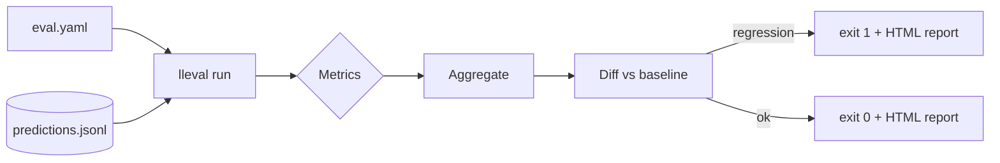

# LLM Eval Harness

> Drop-in evaluation for GenAI repos: **plugin metrics**, **LLM-as-Judge** (with
> stored reasoning traces), **HTML diff reports**, and a **reusable GitHub
> Action** that fails a PR when answer quality regresses.

<!-- Badges placeholder: CI, license, coverage -->

---

## Why this exists

Unit tests catch crashes, not "the answers got worse." This harness scores your
model's recorded outputs, diffs them against a baseline, and **gates merges on
quality regression** — the part teams keep rebuilding by hand.

## Highlights

- **3-line CI gate** via a reusable composite GitHub Action.
- **Plugin metrics** — adding a metric is one new file. Built-ins: `exact_match`,
  `keyword_coverage`, `groundedness`, `llm_judge`.
- **LLM-as-Judge** routed through a pluggable judge (deterministic offline by
  default; point it at Claude or any provider), with a **stored reasoning trace**
  per score for audit.
- **HTML + JSON + Markdown reports** with a baseline diff.
- **Hermetic** — the core runs offline and deterministically, so CI is fast and
  reproducible.
- **Framework adapters** (Ragas / DeepEval / Promptfoo) behind the same metric
  protocol, loaded only when selected.

## How it works

You record your model's outputs to a JSONL file, then point `lleval` at it:

```json
{"id": "q1", "input": "What is pgvector?", "output": "A Postgres extension for vector search.",
 "contexts": ["pgvector adds vector similarity search to Postgres."],
 "reference": "A Postgres extension for vector similarity search."}
```

```yaml
# eval.yaml
dataset: predictions.jsonl
baseline: baseline.json
metrics: [exact_match, keyword_coverage, groundedness, llm_judge]
threshold: 0.05
```

```bash
pip install -e .
lleval run --config eval.yaml          # exits non-zero on regression
lleval run --config eval.yaml --update-baseline
```

## Use it in CI (3 lines)

```yaml
- uses: jeanmalaquias/llm-eval-harness@v1
  with:
    config: eval.yaml
```

## Architecture



Full design: [docs/architecture.md](docs/architecture.md).

## Adding a metric

Create one file in `src/lleval/metrics/`, implement the `Metric` protocol, and
register it — no core changes. See `docs/architecture.md` §3.

## Status / roadmap

- [x] Plugin metric architecture + 4 built-in metrics
- [x] Config-driven runner, baseline diff, regression gate
- [x] HTML + JSON + Markdown reports
- [x] Reusable GitHub composite Action + example app
- [ ] Framework adapters (Ragas / DeepEval / Promptfoo) — interfaces in, impls next
- [ ] Next.js trend dashboard + DVC dataset versioning

## License

MIT (see [LICENSE](LICENSE)).
