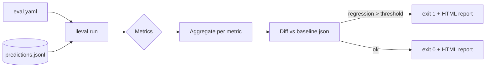

# LLM Eval Harness — Design

> Status: **Draft for review** · Owner: Jean Malaquias · Last updated: 2026-06-16

A drop-in evaluation harness that any GenAI repo can add to CI to **gate merges
on quality regressions**. This document is the authoritative design.

---

## 1. Problem statement

Teams ship prompt and model changes with no automated quality signal. Unit tests
catch crashes, not "the answers got worse." Eval frameworks exist (Ragas,
DeepEval, Promptfoo, TruLens) but wiring them into CI, versioning datasets,
comparing against a baseline, and failing the build on regression is bespoke
work every team redoes.

This harness makes that turnkey: record your model's outputs, point `lleval` at
them, and a **3-line GitHub Action** scores them, diffs against a baseline, and
fails the PR if any metric regresses beyond a threshold.

### Goals

1. **CI gate**: `lleval run --config eval.yaml` exits non-zero on regression.
2. **Reusable GitHub Action**: other repos adopt it in three lines of YAML.
3. **Plugin metrics**: adding a metric is one new file; no core changes.
4. **Framework-agnostic**: built-in metrics plus adapters for Ragas / DeepEval /
   Promptfoo (the harness orchestrates; frameworks compute).
5. **Auditable LLM-as-Judge**: every judged score keeps its reasoning trace.
6. **Hermetic by default**: the core runs offline and deterministically so CI is
   fast and reproducible; the judge is configurable to a real model.

### Non-goals (v1)

- Running your application. The harness scores **recorded predictions** (a
  JSONL of inputs/outputs/contexts/references) — the same separation real eval
  pipelines use. You produce predictions; the harness grades them.
- The Next.js trend dashboard and DVC dataset versioning (roadmap).

---

## 2. Data model

A **prediction record** (one JSONL line) is the unit of evaluation:

```json
{"id": "q1", "input": "What is pgvector?", "output": "A Postgres extension...",
 "contexts": ["pgvector adds vector similarity search to Postgres."],
 "reference": "A Postgres extension for vector similarity search."}
```

- `input` — the prompt/question.
- `output` — the model's answer (the thing under test).
- `contexts` — retrieved passages (for RAG groundedness metrics). Optional.
- `reference` — the gold answer. Optional (some metrics are reference-free).

---

## 3. Metrics (plugin architecture)

A metric scores one prediction in `[0, 1]`. Metrics register by name; adding one
is a single new file that implements the protocol and registers itself.

```python
class Metric(Protocol):
    name: str
    requires: tuple[str, ...]          # fields it needs, e.g. ("reference",)
    async def score(self, record: Prediction) -> Score   # value + optional trace
```

Built-in (offline, deterministic):

| Metric | What it measures | Needs |
|--------|------------------|-------|
| `exact_match` | output equals reference (normalized) | reference |
| `keyword_coverage` | fraction of reference keywords present in output | reference |
| `groundedness` | fraction of output supported by the contexts | contexts |
| `llm_judge` | a judge model's rating against the reference | reference |

`llm_judge` routes through a pluggable **judge** (default a deterministic
heuristic judge for hermetic CI; configurable to Claude or any provider). Each
judged score stores the judge's reasoning trace for audit.

Framework adapters (`ragas`, `deepeval`, `promptfoo`) wrap those libraries
behind the same protocol and load only when selected.

---

## 4. Flow



1. Load config (dataset, metrics, thresholds, baseline, judge).
2. Score every record with every selected metric.
3. Aggregate to a per-metric mean.
4. Diff against the baseline; any metric below `baseline - threshold` is a
   regression.
5. Emit a Markdown summary (stdout), a JSON summary, and an HTML diff report.
6. Exit non-zero if there are regressions (the CI gate).

`--update-baseline` records the current aggregate as the new baseline.

---

## 5. CI integration

A composite GitHub Action wraps install + run so a consuming repo needs three
lines:

```yaml
- uses: jeanmalaquias/llm-eval-harness@v1
  with:
    config: eval.yaml
```

---

## 6. Quality attributes

| Attribute | Target |
|-----------|--------|
| Hermetic | Core + default judge run with no network; same input → same scores |
| Speed | < 5 min for 100 records with the offline metrics |
| Extensible | New metric = one file; new framework = one adapter |
| Auditable | Every `llm_judge` score stores a reasoning trace |
| Portable | Scores recorded predictions; no coupling to any app/framework |

---

## 7. Roadmap (post-v1)

- Next.js dashboard of metric trends over time (Postgres-backed).
- DVC-versioned golden datasets.
- Evidently AI distribution-drift checks.
- Semantic caching of judge calls to cut cost.
